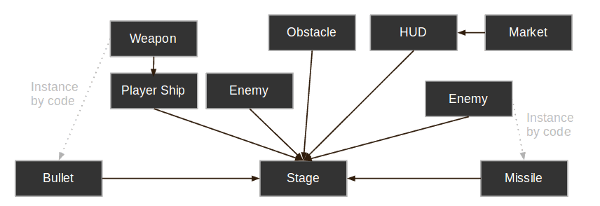
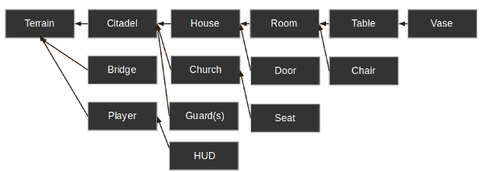

## Quickly guide for Godot Engine

---

### Nodes ~~Nodos~~

Nodes are fundamental building blocks for creating a game.

Nodes have theses features:

- It has a name
- It has a editable properties
- It can receive a callback to process every frame
- It can be extended (to have more functions)
- It can be added to other nodes as children

Multiples nodes related create a tree.
In Godot this way creates a powerful tool for organizing projects.

```Spanish
*Los nodos son bloques de construcción fundamentales para la creación de un juego.*

Los nodos tienen las siguientes caracteristicas:*

- *Tienen un nombre*
- *Tienen propiedades editables*
- *Pueden recibir un llamado a procesar en cualquier momento*
- *Puede ser extendido para obtener más funciones*
- *Puede ser añadido a otros nodos como hijo

*Multiples nodos relacionados crean un arbol.*
*Esto hace que godot tenga una herramienta poderosa para la organización de proyectos.*
```


---

### Scenes ~~Escenas~~

A scene is composed of a group of nodes organized hierarchically (in tree fashion). Furthermore, a scene:

- Always has only one root node
- Can be saved to disk and loaded back
- Can be instanced (more on that later)

In Godot running a game means running a scene, a project can contain several scenes.
Basically, Godot is a **scene editor**. 

```Spanish
Una escena esta compuesta por un grupo de nodos organizados de forma jerarquica (en forma de arbol). Por otro lado una escena:
- Siempre tiene un nodo raíz
- Puede ser almacenada en los ficheros y puede ser cargada
- Puede ser instanciada (varias veces más luego)
En Godot la ejecución del juego hace referencia a la ejecución de una escena, un proyecto puede contener multiples escenas.
En otras palabras Godot es un editor de escenas.
```

---

### IE of Scenes diagram ~~Ejemplo de diagrama de escenas~~

Shooter game example



Example from http://docs.godotengine.org/en/3.0/getting_started/step_by_step/instancing_continued.html

Open World Game example



Example from http://docs.godotengine.org/en/3.0/getting_started/step_by_step/instancing_continued.html

---

### Configuration of ProjectSettings ~~Configuración del ProjectSettings~~

ProjectSettings uses singleton software design pattern, in other words ProjectSettings is an unique object instance.

It contains global variables accessible from everywhere.

```
El ProjectSettings utiliza el patrón de diseño singleton, en otras palabras ProjectSettings es una instancia única.
Esto contiene variables globales accesibles por cualquiera.
```

---

### Example of GDScript ~~Ejemplo de GDScript~~

```GDScript
# A file is a class!

# Inheritance

extends BaseClass

# Member Variables

var a = 5
var s = "Hello"
var arr = [1, 2, 3]
var dict = {"key": "value", 2:3}
get_path
# Constants

const ANSWER = 42
const THE_NAME = "Charly"

# Enums

enum {UNIT_NEUTRAL, UNIT_ENEMY, UNIT_ALLY}
enum Named {THING_1, THING_2, ANOTHER_THING = -1}

# Built-in Vector Types

var v2 = Vector2(1, 2)
var v3 = Vector3(1, 2, 3)

# Function

func some_function(param1, param2):
    var local_var = 5

    if param1 < local_var:
        print(param1)
    elif param2 > 5:
        print(param2)
    else:
        print("Fail!")

    for i in range(20):
        print(i)

    while param2 != 0:
        param2 -= 1

    var local_var2 = param1 + 3
    return local_var2

# Functions override functions with the same name on the base/parent class.
# If you still want to call them, use '.' (like 'super' in other languages).

func something(p1, p2):
    .something(p1, p2)

# Inner Class

class Something:
    var a = 10

# Constructor

func _init():
    print("Constructed!")
    var lv = Something.new()
    print(lv.a)

```

---


### Shortcuts in Godot's Editor ~~Atajos en el editor de Godot~~

**CTRL** + **K**: Comment or Uncomment a block of code